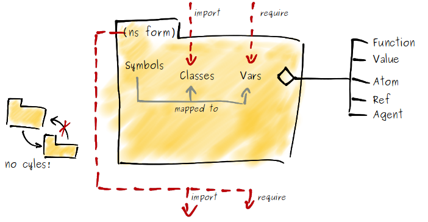

# Introduction to namespaces

A namespace is a dynamic mapping from symbols to vars.




## Simple commands in the REPL

`(ns foo.bar)` switches to namespace foo.bar.

`(use 'foo.baz)` compiles and loads foo.baz namespace into the current namespace.

`*ns*` references the current namespace.

`(def s (...))` interns a var in the current namespace that can be referenced by the symbol `s`.

`(ns-unmap *ns* 's)` removes the var that the symbol `s` references from the current namespace.


## Query functions on namespaces

`ns-interns` returns a map of symbols to vars that the given ns defines.

`ns-publics` like ns-interns, but only public mappings.

`ns-refers` returns a map of symbol to vars that the given ns refers to. 

`ns-imports` returns a map of symbol to class names that the given ns refers to.

`ns-map` returns a map of all namespace mappings of the given ns.


## Exercise 1

 * Define some symbols in the current namespace.
 * List all symbols that the current namespace defines.
 * Remove one mapping.


## Exercise 2

Create a map of name to function var for all functions with a suffix like "-page".
 
```clojure
(defn s-page
  []
  "S")


(nsfns "-page" *ns*)
;=> { "s" #'user/s-page }
```


## The ns form

An example

```clojure
(ns foo.bar "documentation"
  (:require [clojure.tools.logging :as log]      ; introduce ns alias
            [clojure.test :refer :all]           ; use all public vars
			[clojure.string :refer [blank?]]     ; use only selected vars
			[:refer-clojure :exclude [map]])     ; exclude clojure default vars
  (:import [java.utils ArrayList HashMap]))
```


## Exercise 3

Take the [solution of exercise 2](/namespaces-solution/src/nsfns.clj) and add it to the webapp.
Add another function `render` and extend the webapp application handler `app` so 
that a URL /pages/:page is generically dispatched to a function named <page>-page.

For example, if you have two rendering functions defined
```clojure
(defn s-page [] "S") 

(defn t-page [] "T")
```

and an application handler app

```clojure
(defroutes app
  (GET "/page/:page" [page] (render page)))
```

then in a REPL you can enter
```clojure
(app {:uri "/page/s" :request-method :get})
;=> {:status 200, :headers {"Content-Type" "text/html; charset=utf-8"}, :body "S"}
```

This means the function `render` executes the renderer function that corresponds to
the URL.


## Refresh using org.clojure/tools.namespace

Include in your project.clj `[org.clojure/tools.namespace "0.2.4"]` as dependency.

`(use '[clojure.tools.namespace.repl :only (refresh)])` imports the refresh function.

`(refresh)` destroys and reloads all namespaces that have changed since the last refresh.


## Exercise 4

 * Create two files, foo.clj and bar.clj, each declaring a corresponding ns.
 * Define one function per file, the function foofn calls a the function barfn.
 * Start a REPL, `(use 'foo)`, execute foofn.
 * Change barfn in bar.clj without reloading the namespace bar.
 * Use the clojure.tools.namespace.repl ns as shown above and call `(refresh)`.
 * Execute foofn again.


# License

Copyright © 2013 F.Riemenschneider

Distributed under the Eclipse Public License, the same as Clojure.
