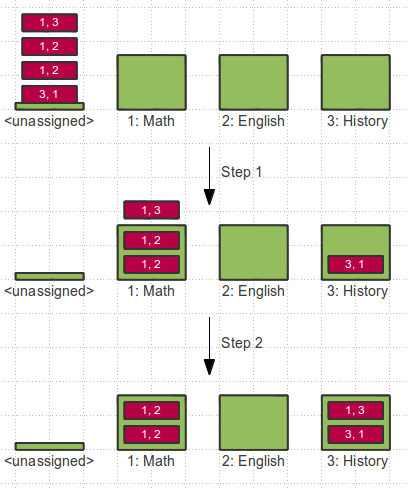

# Some algorithmic practicums in Clojure

Here are the exercises:

## Prime numbers
Find all prime numbers up to N.

The idea using the Sieve of Eratosthenes is to initially list all numbers from 2 to N.
Start with the first P which is guaranteed to be prime, then remove all multiples of P.
Continue with the next until P > sqrt(N)

See the [Sieve of Eratosthenes](http://en.wikipedia.org/wiki/Sieve_of_Eratosthenes) for further explanation.


## Square root calculation

Given a number N, find the square root of N.

The Babylonian method of square root approximation starts with
an initial guess G\_0 of a solution.

Given a guess G\_n a better solution is always G\_n+1 := (N / G\_n + G\_n) / 2.

Repeat this until the error is small enough.

Read [methods for computing square roots](http://en.wikipedia.org/wiki/Methods_of_computing_square_roots)
to learn more.


## Topological ordering of a graph

The task is to create a topological order of all nodes of a graph.
See [this article](http://en.wikipedia.org/wiki/Topological_sorting) to find out what this is.

The graph can be represented as a map:

```clojure
(def g {:a []
        :b [:a]
        :c []
        :d [:c :b]
        :e [:a :b :c :d]})
```

The top-order of the a graph like above is `(:e :d :c :b :a)`. 


## Partition by Equality

Define a function partition-by-eq that takes
a binary predicate p and a sequence xs and returns
a sequence of partitions.

The elements of a sub-sequence X\_1 to X\_n belong to the
same partition if all (p X\_1 X\_2) to (p X\_n-1 X\_n) hold true.

Example of application:
`(partition-by-eq < [1 2 3 2 3 4])` will produce `((1 2 3) (2 3 4))`.


## Course assignment

Think of the problem of assigning persons to training courses where
each person opted for the courses he/she likes best in descending order.
Each course has a limited number of places therefore not everyone
will get into the course he/she likes best.
Given such a constraint the goal is to assign everyone to a course that
matches his/her personal preference as close as possible.

An instance of this problem in Clojure data might look like this:
```clojure
(def groups [{:id 0 :title "<unassigned>" :max 0}
             {:id 1 :title "Math" :max 2}
             {:id 2 :title "English" :max 2}
             {:id 3 :title "History" :max 2}])

(def persons [{:name "Donald" :prefs [1 3] :group 0}
              {:name "Daisy" :prefs [1 2] :group 0}
              {:name "Mickey" :prefs [1 2] :group 0}
              {:name "Goofy" :prefs [3 1] :group 0}])
```

One algorithm to solve the assignment problem works in passes and increases
a preference index with each pass.
The preference index starts at 0, so for the first pass the best-liked course
is chosen, in the second pass the second-best-liked and so on.

Initially all persons are assigned to the special group "\<unassigned\>"
which must not have any members and is therefore over-booked.

In each pass persons are moved from over-booked courses to those that
have places left if their preference at the current index matches one
of the available courses.

See the following picture for an illustration:




At the heart of my solution is a function that takes
a group (which then contains a sequence of assigned persons), a set of
group-ids that have places left and returns a sequence of pairs
[person-name group-id] that denotes all moves that are needed to
remove the excessive assignments.


## License

Copyright © 2013 F.Riemenschneider

Distributed under the Eclipse Public License, the same as Clojure.
