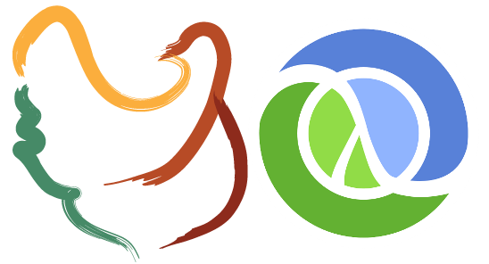

# '(quasiconf 2014)

**The pan-Lisp day at FrOSCon 9**

**St. Augustin (Germany), August 23/24, 2014**

A collaboration of the Clojure User Groups
[Cologne](http://www.meetup.com/clojure-cologne/) and
[Bonn](https://groups.google.com/forum/#!forum/clojure-user-group-bonn).

# Programme

**In the morning: Talks**

Title | Speaker
--- | ---
About Scheme | Moritz Heidkamp, bevuta
Emacs Lisp | Vasilij Schneidermann
Clojure in Production | Gerrit Hentschel, doo

**In the afternoon: Hands-on**

As a gentle introduction we begin with "Clojure in 90 Minutes" by Ingo Küper, doctronic

We continue with a *Clojure Kickstart Workshop*:

Most people with a background in static imperative OO programming face
initial difficulties in getting started with a dynamic Lisp-style
functional language like [Clojure](http://clojure.org/). Which is sad
because programming in Clojure is a great experience.

We can help!

Read more about the [Clojure Kickstart Workshop](kickstart.md).

# Supported by

* [bevuta IT GmbH](http://www.bevuta.com)
* [doctronic GmbH & Co. KG](http://www.doctronic.de/)
* [doo GmbH](https://doo.net/)
* [itemis AG](http://www.itemis.de/)
