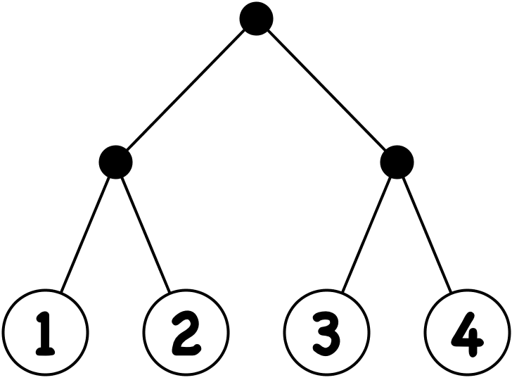
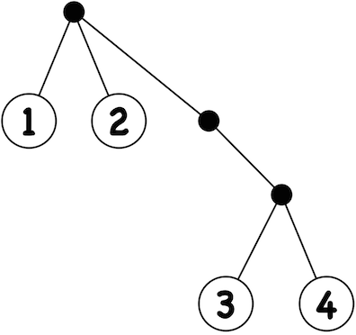
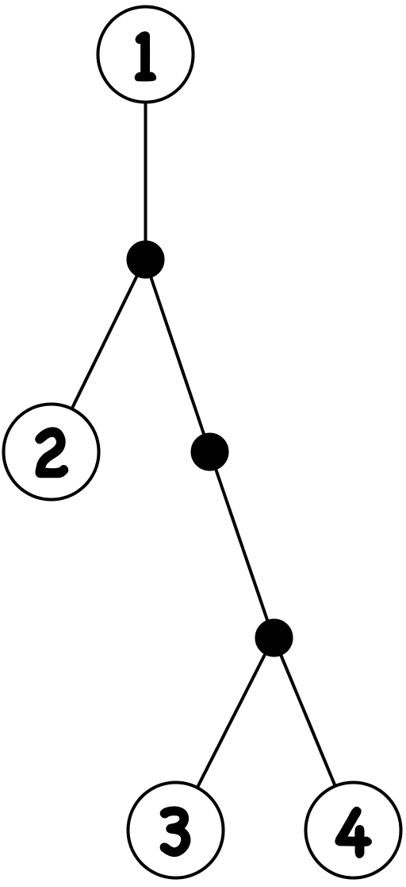

# Zipper Primer

First steps into the wonderful world of uniform hierarchical data processing

## Hierarchy is everywhere

When thinking of hierarchical data, words like "XML", "XHTML", "Relational Database"
or "a tree" may come into mind. But these are _forms_, _structures_, _representations_ or
_organisations_, not data.

Let's focus on data: Hierarchical data belonging to a certain domain may be obvious:
A genealogy software will unsurprisingly use terms like "parents", "children" and the like.

But even if not required by the domain, you can _choose_ to see hierarchies:
"This article has been read by these persons" or "this operand is part of that equation"
or "this list is just a degenerated tree".

## Parts and pieces

Hierarchical data consists of nodes and edges.
A node _may_ have a value.

For now, let's assume that there will be exactly one path between two nodes.
And we call it a tree.
The-node-where-it-all-starts is called "root".
But under these circumstances the root is simply a point of view:



## Data modelling

A naive data model approach of the arboreal first view could be a map:

```clojure
    (def data {:root [{:node [1 2]} {:node [3 4]}]})
```

But **root** is an unnecessary part of information, because there will always be exactly one root.
Same goes for **node**, because there will be only nodes.
Stripping **root** and **nodes** apart leads to

```clojure
    (def data [[1 2] [3 4]])
```

And this is a nested vector.
Working with nested vectors is easy:
You can access and _change_ single values:

```clojure
    (get-in data [0 0])
    (assoc-in data [0 1] "CUGB")
```

Now let's use a map to model this talk:

```clojure
    (def talk {:talk "Clojure Zipper Primer"
               :speaker {:person {:firstname "Ingo"
                                  :lastname "Küper"}}}
```

You can read a single value:

```clojure
    (get-in talk [:speaker :person :lastname])
```

You can even add a nested value:

```clojure
    (assoc-in talk [:speaker :company] "doctronic GmbH & Co. KG")
```

So Clojure has great support for working with hierarchical data models.
That's all nice and easy if you **know** the path of the involved element
or if you can **calculate** that path.
But you can **not move nor navigate** within the hierarchical data.
(Unless you do some constant path (re)calculations, of course.)

But the greates disadvantage by far is **the data model leaking in the algorithm:**
* If you use nested vectors, you have to use indices.
* If you use nested maps, you have to use keywords.
* If you use XML, you may find yourself lost in the DOM- or SAX-API.
* Your algorithm will be flooded by details of the data model.
  Changing the data model from nested vectors to XML means rewriting the algorithm.

And that's no good.
Let's decouple the algorithm from the concrete data model.

## Zippers to the rescue

Zippers were introduced by [Gérard Huet](http://pauillac.inria.fr/~huet/)
in [1997](http://yquem.inria.fr/~huet/PUBLIC/zip.pdf).

A zipper separates the tree's structure from its values.
You will navigate through, examine and even reconstruct the tree by the use of _Locations_.
A _Location_ is a (horrific simple) data structure managed by the
[Zipper API](https://clojuredocs.org/clojure.zip).
It contains information about the parent and the children and the siblings of a node.
Usually, you have exactly one current node and therefore one current _Location_,
but you're not limited to that.

To use zippers, add

```clojure
    (:require [clojure.zip :as zip])
```
    
to your namespace.

Let's create a zipper for the nested vector representation of the tree,
move downwards two times and get the node's value:

```clojure
    (def data [[1 2] [3 4]])

    (-> data
        (zip/vector-zip)
        (zip/next)
        (zip/next)
        (zip/node))
```

* ``zip/vector-zip`` returns the _Location_ information of the root node.
* ``zip/next`` operates on _Locations_.
  It moves downwards, because it uses a
  [Depth-First](https://en.wikipedia.org/wiki/Depth-first_search)
  approach to get to the next node.
  The result is the _Location_ of the next node.
* ``zip/node`` takes a _Location_ of a node and returns the node's data.

### Combined with the power of Clojure (``data_processing.clj``)

A _Leaf_ is a node without children.

Let's use
[Function Composition](https://en.wikipedia.org/wiki/Function_composition_%28computer_science%29)
and
[Sequences](http://clojure.org/sequences)
to get the values of all _Leaves_.

```clojure
    (def data [[1 2] [3 4]])

    (defn leaf-nodes
      [zipper]
      (->> zipper
           (iterate zip/next)
           (take-while (complement zip/end?))
           (filter (complement zip/branch?))
           (map zip/node)))

    (-> data
        (zip/vector-zip)
        (leaf-nodes))
```

* ``(iterate zip/next)``
  returns an infinite sequence of nodes, repeating the last node ad infinitum.
* ``(take-while (complement zip/end?))``
  returns a finite sequence of all nodes.
* ``(filter (complement zip/branch?))``
  returns a sequence of non-branching (a.k.a. _Leaf_) nodes.
* ``(map zip/node)``
  returns a sequence of node values.

Great fun!
Now let's change the value of every _Leaf_ to "CUGB":

```clojure
    (def data [[1 2] [3 4]])

    (defn replace-leaf-nodes
      [zipper]
      (->> zipper
           (iterate (fn [loc]
                      (zip/next
                       (if (zip/branch? loc)
                         loc
                         (zip/replace loc "CUGB")))))
           (filter zip/end?)
           (first)
           (zip/root)))

    (-> data
        (zip/vector-zip)
        (leaf-nodes))
```

Can you figure out how ``repleace-leaf-nodes`` works?

### Changing the data model

Magnificent and marvelous so far!

Now let's change the data model. Same data, other model:

A calculation recipe, which will result in a lazy-sequence of values:

```clojure
    (def data (partition 2 (range 1 5)))
```

Or a XML representation:

```clojure
    (def data
      "<root>
         <branch>
           <node>1</node>
           <node>2</node>
         </branch>
         <branch>
           <node>3</node>
           <node>4</node>
         </branch>
       </root>")
```

***And the only thing you need to change is the creation of the zipper!***

Use

```clojure
    (zip/seq-zip data)
```

for sequences and

```clojure
    (zip/xml-zip (parse-xml-string data))
```

for XML data (given as a string and parsed by a simple function like

```clojure
    (defn parse-xml-string
      [s]
      (xml/parse (java.io.ByteArrayInputStream. (.getBytes s))))
```

Use

(xml/emit (replace-leaf-nodes
           (zip/xml-zip (parse-xml-string data))))

at the REPL to get

```xml
    <?xml version='1.0' encoding='UTF-8'?>
    <root>
      <branch>
        <node>
          CUGB
        </node>
        <node>
          CUGB
        </node>
      </branch>
      <branch>
        <node>
          CUGB
        </node>
        <node>
          CUGB
        </node>
      </branch>
    </root>
```

Amazing! We can change the data model without affecting our data processing functions!

### Data transformation (``data_transformation.clj``)

But there is even more a zipper can do for you:

If you have a flat data model, but the data _could_ be interpreted in one (or more!)
hierarchical way, you don't need to convert them! Use a zipper!

Let's say we got a flat data structure of customers, projects and teams:

```clojure
    (def data
      [{:customer 1
        :project "Clojure User Group"
        :team "Clojure"}
       {:customer 1
        :project "Java Web-Services"
        :team "Java"}
       {:customer 2
        :project "Clojure Web-Services"
        :team "Clojure"}
       {:customer 2
        :project "Java User Group"
        :team "Java"}])
```

You can break down several information:
_"Show me all projects per customer"_ or
_"Show me all projects per team"_ or
_"Show me all projects per customer per team"_
for example.

Using a zipper, you may end up having this piece of code

```clojure
    (->> data
         (group-all-by :customer)
         (group-all-by :team))
```

to get this result

```clojure
    {:customer
      {1
        {:team
          {"Clojure"
            [{:customer 1, :project "Clojure User Group", :team "Clojure"}],
           "Java"
            [{:customer 1, :project "Java Web-Services", :team "Java"}]}},
       2
         {:team
           {"Clojure"
             [{:customer 2, :project "Clojure Web-Services", :team "Clojure"}],
            "Java"
             [{:customer 2, :project "Java User Group", :team "Java"}]}}}}
```

To use a zipper, you only need to define three functions

* a predicate which returns ``true`` for nodes which _may_ have children.
* a function to return a nodes children, if any.
* a function to create a node with a given set of children

and call [zip/zipper](http://clojuredocs.org/clojure.zip/zipper)
to create the _Location_ of the root node.

## Challenges

To get your head around zippers, you need to think in _Locations_ within a
hierarchical structure and wandering around from one _Location_ to another.
If you need a node's value, you take the value at the node's _Location_.

Thankfully, changing a tree isn't possible. You will always get a new tree.
If you change the tree's structure by adding or removing nodes, you get a
new _Location_. So you may end up having four different worlds:

* the values (nodes) of the old tree
* the structural information (_Locations_) of the old tree
* the nodes of the new tree
* the _Locations_ of the new tree

The "new tree" is sometimes called "future tree", because you're just at
a certain _Location_ and haven't seen the full new tree yet.
And in fact it doesn't even exists at that point of time.
To materialize the new tree, you need to head to its root and emit the whole beast.

## Resources

* [Zipper API](https://clojuredocs.org/clojure.zip)
* [Getting Acquainted With Clojure Zippers](http://josf.info/blog/2014/03/21/getting-acquainted-with-clojure-zippers/)
* [Clojure Zippers: Structure Editing With Your Mind](http://josf.info/blog/2014/03/28/clojure-zippers-structure-editing-with-your-mind/)
* [Seqs of Clojure Zippers](http://josf.info/blog/2014/04/14/seqs-of-clojure-zippers/)
